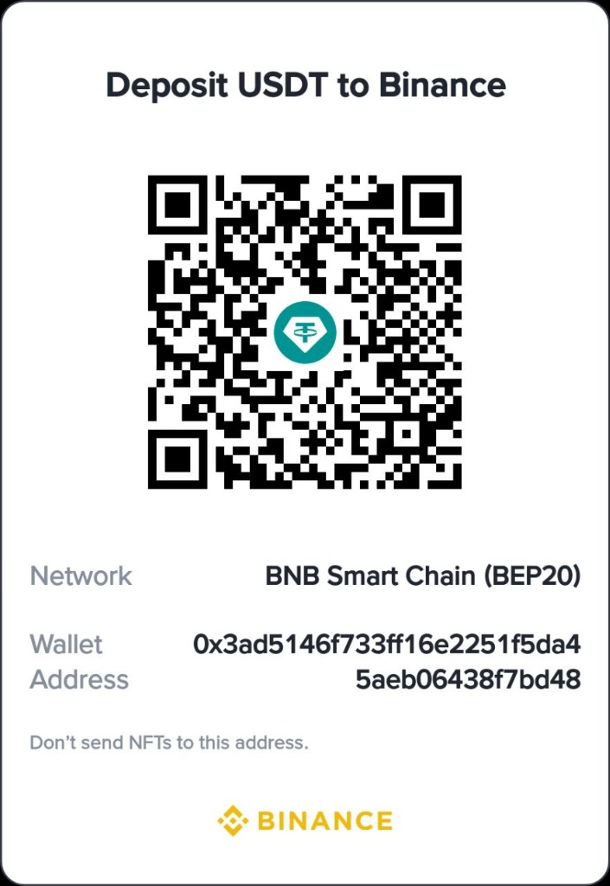
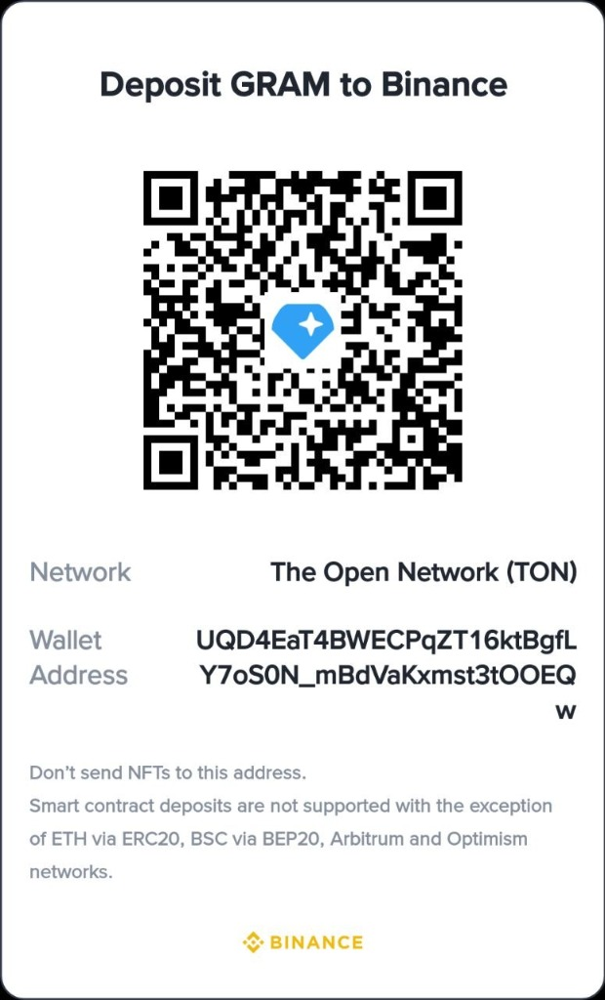

<div align="center">

# ⚡ ESP8266 Power Outage Monitor

[](https://opensource.org/licenses/MIT)
[](https://www.espressif.com/en/products/socs/esp8266)
[](https://www.arduino.cc/)
[](https://platformio.org/)
[](https://t.me/AnbuSoft)

**A complete, production-ready Electricity Monitoring System using ESP8266 (NodeMCU).**

Track power outages, get instant Telegram alerts, view beautiful reports — all running locally on a $3 microcontroller. No cloud. No subscription. No battery needed.

---

</div>

## 📸 Screenshots

> _Coming soon! Flash the firmware and see the beautiful Glassmorphism UI yourself._

---

## ✨ Features

| Feature | Description |
|---------|-------------|
| 🔌 **No Battery Required** | Calculates outage duration by comparing NTP time with the last heartbeat — no RTC or battery backup needed |
| 🏠 **100% Local & Offline** | Runs entirely on the ESP8266. No Firebase, no cloud, no external database |
| 📊 **Rich Dashboard** | Apple-style Glassmorphism UI with Dark/Light mode, daily/weekly/monthly reports, and interactive charts |
| 📱 **Fully Responsive** | Drawer navigation on mobile, works perfectly on any screen size and DPI |
| 📡 **WiFi NAT Router** | When connected to your home WiFi, the ESP shares internet to all devices connected to its Access Point |
| 🤖 **Telegram Alerts** | Instant notifications with detailed outage stats — duration, timestamps, total count, averages |
| 🔄 **OTA Updates** | Update firmware wirelessly from the web dashboard (ElegantOTA) |
| 🔔 **Hardware Buzzer** | Configurable GPIO buzzer that beeps when power is restored |
| 💾 **Data Persistence** | Events stored in LittleFS flash memory, survives unlimited power cycles |
| 🗂️ **Auto Log Rotation** | Keeps 90 days of history, auto-backs up to Telegram and purges when storage exceeds 85% |
| 📤 **CSV/JSON Export** | Download your complete outage history from the Event History tab |
| 🔒 **Secure** | Full HTTP Basic Auth on dashboard & API (default: `admin` / `admin`) |
| 📶 **AP Fallback** | Auto-creates Access Point if WiFi is unconfigured or unreachable |

---

## 🧠 How It Works

```
┌──────────────────────────────────────────────────────────────┐
│                     POWER IS ON                              │
│                                                              │
│  ESP8266 is running. Every 60 seconds it writes a            │
│  "heartbeat" timestamp to flash memory (/last_alive.txt)     │
└──────────────────────────┬───────────────────────────────────┘
                           │
                    ⚡ POWER GOES OUT
                           │
┌──────────────────────────▼───────────────────────────────────┐
│                     POWER IS OFF                             │
│                                                              │
│  ESP8266 has no power. Nothing runs. But the last            │
│  heartbeat timestamp is safely stored in flash memory.       │
└──────────────────────────┬───────────────────────────────────┘
                           │
                    🔌 POWER RETURNS
                           │
┌──────────────────────────▼───────────────────────────────────┐
│                     POWER IS BACK                            │
│                                                              │
│  1. ESP8266 boots up                                         │
│  2. Connects to WiFi → Syncs real time via NTP               │
│  3. Reads last heartbeat from flash                          │
│  4. Calculates: outage = NOW - last_heartbeat                │
│  5. Logs the event permanently                               │
│  6. Sends detailed Telegram notification                     │
│  7. Dashboard shows everything                               │
└──────────────────────────────────────────────────────────────┘
```

---

## 🚀 Getting Started

### 📦 Hardware You Need

| Component | Required | Notes |
|-----------|----------|-------|
| ESP8266 Board (NodeMCU v2/v3, Wemos D1 Mini) | ✅ Yes | Any ESP8266 board works |
| USB Power Adapter | ✅ Yes | Plug into the mains circuit you want to monitor |
| Active Buzzer / LED | ❌ Optional | Connect to GND + any GPIO (e.g. D1/GPIO5) |
| Micro USB Cable | ✅ Yes | For initial flashing only |

### 🔧 Software Setup

> **Prerequisites:** [Visual Studio Code](https://code.visualstudio.com/) + [PlatformIO Extension](https://platformio.org/)

```bash
# 1. Clone the repository
git clone https://github.com/anbuinfosec/EspElectrycityMonitor.git
cd EspElectrycityMonitor

# 2. Open in VS Code with PlatformIO

# 3. Build the firmware
#    Click the ✓ Build button on the PlatformIO toolbar

# 4. Upload firmware to ESP8266
#    Click the → Upload button (ESP must be connected via USB)

# 5. Upload the web UI files to flash
#    PlatformIO sidebar → env:nodemcuv2 → "Upload Filesystem Image"
```

> ⚠️ **Step 5 is critical!** Without uploading the filesystem image, the web dashboard won't load.

---

## 📱 First Boot & Setup

| Step | Action |
|------|--------|
| 1️⃣ | Power on the ESP8266. It will create an Access Point since WiFi isn't configured yet |
| 2️⃣ | Connect your phone/laptop to WiFi: **`EspElectrycityMonitor`** (Password: **`anbuinfosec`**) |
| 3️⃣ | Open browser → go to `http://192.168.4.1` |
| 4️⃣ | Login with default credentials: **Username:** `admin` **Password:** `admin` |
| 5️⃣ | Go to **Settings** → Enter your home Router WiFi SSID & Password → Click **Connect Now** |
| 6️⃣ | Once connected, the WiFi section shows ✅ with a **Forget** button if you need to change networks |
| 7️⃣ | Change the Admin Password to something secure! |
| 8️⃣ | Click **Save Settings**. You're done! |

> 💡 After connecting to your router, the ESP shares the internet to all devices on its Access Point via NAT routing!

---

## 🤖 Telegram Notifications Setup

Get instant alerts on your phone when power goes out or comes back!

### Setup Steps

1. **Create a Bot:** Open Telegram → Search `@BotFather` → Send `/newbot` → Copy the **Bot Token**
2. **Get your Chat ID:** Message `@userinfobot` or `@RawDataBot` in Telegram to find your Chat ID
3. **Configure:** Go to ESP Settings Dashboard → Check ✅ "Enable Telegram" → Paste Token & Chat ID → **Save**

### 📬 Notification Examples

**Power Restored (with full stats):**
```
⚡ Power Restored!

🔴 Lost at: 2026-08-04 03:30:00
🟢 Back at: 2026-08-04 03:45:00
⏱ Outage: 15 Minutes

📊 All-Time Stats:
• Total outages: 7
• Total downtime: 3 Hours 42 Minutes
• Longest outage: 1 Hour 15 Minutes
• Average outage: 31 Minutes
```

**Device Restarted:**
```
🔵 Device Restarted (Manual/OTA)
⏱ 2026-08-04 10:15:30
```

---

## 🔌 API Reference

All endpoints require HTTP Basic Auth (`admin` / your password).

| Method | Endpoint | Description |
|--------|----------|-------------|
| `GET` | `/api/events?page=1&limit=50` | Paginated event history |
| `GET` | `/api/statistics` | Aggregate outage statistics |
| `GET` | `/api/daily-report` | Daily breakdown |
| `GET` | `/api/weekly-report` | Weekly breakdown |
| `GET` | `/api/monthly-report` | Monthly breakdown |
| `GET` | `/api/settings` | Current device configuration |
| `POST` | `/api/settings` | Update settings (JSON body) |
| `GET` | `/api/wifi-scan` | Scan nearby WiFi networks |
| `POST` | `/api/wifi-connect` | Connect to WiFi (JSON: `{ssid, password}`) |
| `GET` | `/api/wifi-status` | WiFi connection status, SSID, IP, RSSI |
| `POST` | `/api/wifi-forget` | Disconnect and forget saved WiFi |
| `POST` | `/api/restart` | Restart the device |

---

## 🏗️ Project Structure

```
📁 EspElectrycityMonitor/
├── 📁 data/                    # Web UI files (uploaded to LittleFS)
│   ├── index.html              # Main dashboard HTML
│   ├── style.css               # Glassmorphism styles
│   ├── app.js                  # Frontend logic
│   └── chart.js                # Chart library
├── 📁 src/                     # ESP8266 firmware source
│   ├── main.cpp                # Entry point, WiFi, NAT, NTP
│   ├── api.cpp                 # REST API endpoints
│   ├── history.cpp             # Event logging & boot detection
│   ├── reports.cpp             # Statistics & report generation
│   ├── settings.cpp            # Configuration persistence
│   ├── storage.cpp             # LittleFS file operations
│   ├── telegram.cpp            # Telegram Bot API integration
│   ├── utils.cpp               # Time formatting & helpers
│   └── webserver.cpp           # Static file serving
├── platformio.ini              # PlatformIO configuration
└── README.md
```

---

## 📊 Memory Usage

| Resource | Usage | Total | Percentage |
|----------|-------|-------|------------|
| **RAM** | ~34.8 KB | 80 KB | ~42% |
| **Flash** | ~530 KB | 1 MB | ~50% |
| **LittleFS** | Dynamic | ~3 MB | For event logs |

---

## 🛡️ Security Notes

- 🔐 Change the default admin password immediately after first login
- 🌐 The dashboard is protected by HTTP Basic Auth on all pages and API endpoints
- 🔒 Telegram uses HTTPS (TLS) via BearSSL for secure communication
- 📡 The AP password should be changed from the default in Settings

---

## 👨‍💻 Author

**AnbuSoft** — IoT & Security Tools

| Platform | Link |
|----------|------|
| 💬 Telegram Channel | [@AnbuSoft](https://t.me/AnbuSoft) |
| 📦 GitHub | [anbuinfosec](https://github.com/anbuinfosec) |

---

## ❤️ Support This Project

If this project helped you, consider supporting development! Every bit helps keep open-source IoT projects alive.

<div align="center">

### 💳 Donation Methods

<table>
  <tr>
    <td align="center"><b>💵 USDT (BEP20)</b></td>
    <td align="center"><b>📱 bKash</b></td>
    <td align="center"><b>💎 GRAM (TON)</b></td>
  </tr>
  <tr>
    <td align="center"></td>
    <td align="center"></td>
    <td align="center"></td>
  </tr>
  <tr>
    <td align="center"><code>0x3ad5146f733ff16e2251<br>f5da45aeb06438f7bd48</code></td>
    <td align="center"><code>01615827704</code></td>
    <td align="center"><code>UQD4EaT4BWECPqZT16kt<br>BgfLY7oS0N_mBdVaKxms<br>t3tOOEQw</code></td>
  </tr>
  <tr>
    <td align="center">BNB Smart Chain</td>
    <td align="center">BanglaQr</td>
    <td align="center">The Open Network</td>
  </tr>
</table>

</div>

---

## 📄 License

This project is licensed under the **MIT License** — see the [LICENSE](LICENSE) file for details.

<div align="center">

Made with ⚡ by [AnbuSoft](https://t.me/AnbuSoft)

</div>
